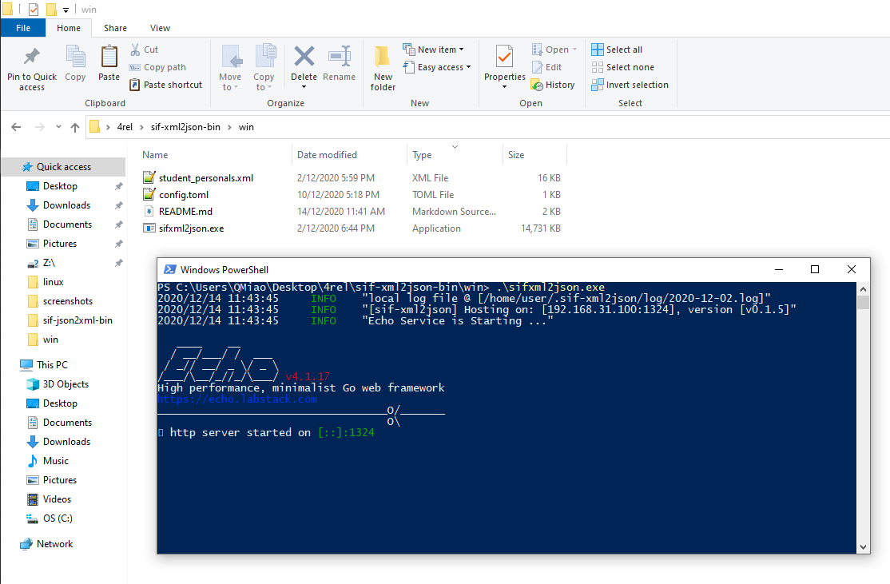
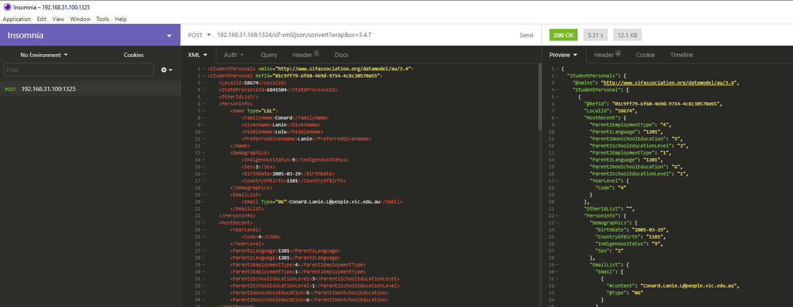
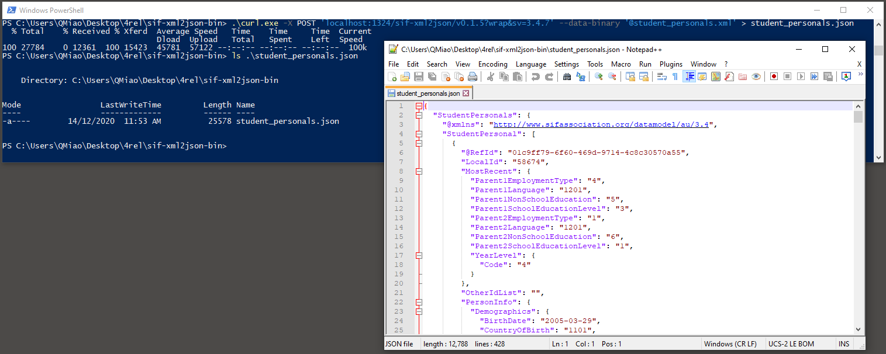

# sifxml2json - a web service for converting SIF XML to JSON

sifxml2json is a web service utility that converts SIF XML to JSON. It has a sister tool [sif-json2xml](https://github.com/nsip/sif-json2xml)
that converts SIF JSON to SIF XML.

### Installation prerequisites
64-bit platforms are supported.

### Download binary packages
   You can download the binary packages from [here](https://github.com/nsip/sif-xml2json/releases) - pull down the Assets list to see current releases.
   (Advanced option) If you prefer to build the binary yourself, here are instructions for doing so.

### Build (optional)
   If you prefer, you can [build the binary yourself](#build-prerequisite).

### What is in each release package ?

 *  **sifxml2json(.exe)**  - the converter web service
 *  **config.toml** - configuration file for the converter web service
 *  **student_personals.xml** - a sample SIF xml file for testing
 *  **screenshots** - the screenshots folder contains images to assist with running and testing sifxml2json
 *  **README.md** - these instructions and other information. Note that you can follow the same installation instructions from either the downloaded readme or the github repository readme (which is rendered to include images inline)

### Installation
   Extract the downloaded zipfile to your chosen working directory, and run the server from there as described below.

### Start server

  Note: A default starting configuration for the server is provided in config.toml. You can edit this if necessary.

   1. In your terminal (Linux/Mac) or Powershell (Windows), navigate to your chosen working directory.
   2. Run sifxml2json(.exe):
   
   `./sifxml2json`
   
   On startup, you should see output messages printed such as service name, server IP:Port and service version:
   
   

### Play with Insomnia

To give you a quick idea of how sifxml2json works, here's how to convert the sample file provided with the installation.

For this test we'll use Insomnia, a REST-based API testing system, to call the converter web service sifxml2json:

1.  If it is not already installed on your machine, download [Insomnia Core](https://insomnia.rest/download/core/?).

2. Start Insomnia

3. Click "New Request" (If you have previously used Insomnia, add a new request from the pulldown on the left hand panel)

4. From the method dropdown on the right, Select `POST`.

5. Add the request `localhost:1324` select `XML` from the body type pulldown, then click Create

6. In the POST field above the centre Request body pane, type `localhost:1324/sif-xml2json/v0.1.5?wrap`

7. Copy the body of the sample file `student_personals.xml` into the centre Request Body panel.

8. Click the Send button. The converted JSON result should be displayed in the right hand Response panel.

### Play with Curl

Curl is a client URL tool that can also be used to call the converter service sifxml2json.

1. Make sure `curl` is available on your machine. 
On Windows, you can get curl.exe from [here](URL for single exe curl) OR you can copy it
from your Windows system folder (C:\Windows\System32\curl.exe). Copy curl.exe to your working directory.

2. In your terminal (Linux/Mac) or Powershell (Windows), navigate to your chosen working directory

3. Run `curl -X POST 'localhost:1324/sif-xml2json/v0.1.5?wrap&sv=3.4.7' --data-binary '@student_personals.xml' > student_personals.json`.

### Notes

   *  If sifxml2json is being run remotely, set the URL `localhost` to the machine's IP address .
   *  The SIF version parameter (URL param `sv`)can be set to the supported SIF data model versions '3.4.6' or '3.4.7'.
   *  Wrapper parameter (URL param `wrap`): if there is a (non-SIF-object) single wrapper root in the XML file you wish to covert, add the `wrap` parameter.

### More information
Here is the current SIF data standard:
http://specification.sifassociation.org/Implementation/AU

## Build Prerequisite

0. Except 'config.toml' content, Do NOT change any project structure & file name & content.

1. Make sure current working directory of your command line environment is identical to the directory of this README.md file.
   i.e. under "/sif-xml2json/"

## Native Build

0. It is NOT supported to make building on Windows OS. If you are using Windows OS, please choose 'Docker Build'.

1. Make sure `golang` dev package & `git` are available on your machine.

2. Run `./build.sh` to build service which embedded with SIF Spec 3.4.6 & 3.4.7.

3. Run `./release.sh [linux64|win64|mac] 'dest-path'` to extract minimal executable package on different.
   e.g. `./release.sh win64 ~/Desktop/sif-xml2json/` extracts windows version bin package into "~/Desktop/sif-xml2json/".
   then 'server' executable is available under "~/Desktop/sif-xml2json/".

4. Jump into "~/Desktop/sif-xml2json/", modify 'config.toml' if needed.
   Please set [Service] & [Version] to your own value.

5. Run `server`.
   Default port is `1324`, can be set at config.toml.

## Docker Build
  
0. Make sure `Docker` is available and running on your machine.

1. Run `docker build --rm -t nsip/sif-xml2json:latest .` to make docker image.

2. In order to do configuration before running docker image.
   Copy '/sif-xml2json/config/config.toml' to current directory, modify if needed, and name it like `config_d.toml`.
   Please set [Service] & [Version] to your own value.

3. Run `docker run --rm --mount type=bind,source=$(pwd)/config_d.toml,target=/config.toml -p 0.0.0.0:1324:1324 nsip/sif-xml2json`.
   Default port is `1324`, can be set at config.toml. If not 1324, change above command's '1324' to your own number.

## Test

0. Make sure `curl` is available on your machine.

1. Run `curl IP:Port` to get the list of all available API path of sif-xml2json.
   `IP` : your sif-xml2json server running machine ip.
   `Port`: set in 'config.toml' file, default is 1324, can be changed in 'config.toml'.

2. Run `curl -X POST IP:Port/Service/Version/convert?sv=3.4.7 -d @path/to/your/sif.xml`
   to convert a SIF.xml to SIF.json

   `IP` : your sif-xml2json server running machine ip.
   `Port`: Get from server's 'config.toml'-[WebService]-[Port], default is 1324.
   `Service`: service name. Get from server's 'config.toml'-[Service].
   `Version`: service version. Get from server's 'config.toml'-[Version].
   `sv`: SIF Spec Version, available 3.4.6 & 3.4.7
   `wrap`: if there is a single wrapper (non-sif-object root) on upload sif.xml, append param `wrap`.  
